# Care Frontend - Flow Diagrams

This document describes the main user flows, actors, and plugin extension points in the Care healthcare management system.

---

## Table of Contents

1. [System Overview](#system-overview)
2. [Actors & Roles](#actors--roles)
3. [User Flows](#user-flows)
   - [Authentication Flow](#authentication-flow)
   - [Patient Management Flow](#patient-management-flow)
   - [Clinical Encounter Flow](#clinical-encounter-flow)
   - [Medication Management Flow](#medication-management-flow)
   - [Care Team Management Flow](#care-team-management-flow)
   - [Facility Management Flow](#facility-management-flow)
   - [Inventory & Supply Chain Flow](#inventory--supply-chain-flow)
   - [Device Management Flow](#device-management-flow)
   - [Scheduling & Appointments Flow](#scheduling--appointments-flow)
   - [Public Appointment Booking Flow](#public-appointment-booking-flow)
   - [Appointment Queuing Flow](#appointment-queuing-flow)
   - [Billing & Accounts Flow](#billing--accounts-flow)
   - [Consent Management Flow](#consent-management-flow)
   - [File Management Flow](#file-management-flow)
   - [Questionnaire & Templates Flow](#questionnaire--templates-flow)
   - [User Preferences Flow](#user-preferences-flow)
4. [Plugin Extension Points](#plugin-extension-points)
5. [Permission System](#permission-system)
6. [State Management](#state-management)
7. [Recent Features](#recent-features)

---

## System Overview

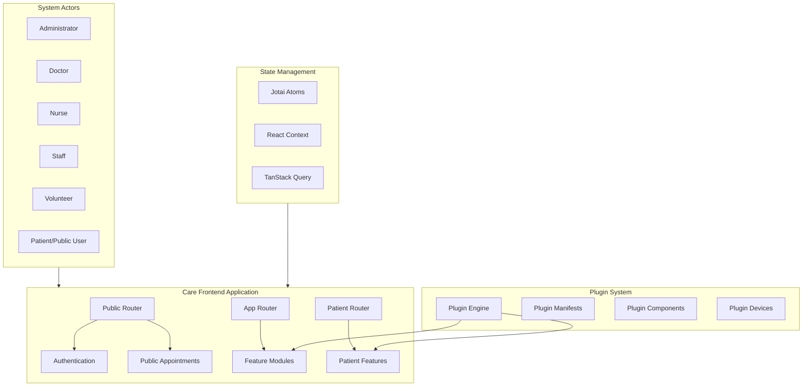

---

## Actors & Roles

### User Types

| Actor | Description | Primary Responsibilities |
|-------|-------------|-------------------------|
| **Administrator** | System administrator | User management, facility configuration, plugin management |
| **Doctor** | Healthcare practitioner | Patient consultations, prescriptions, clinical documentation |
| **Nurse** | Nursing staff | Patient care, vitals monitoring, medication administration |
| **Staff** | General facility staff | Administrative tasks, patient registration, scheduling |
| **Volunteer** | Volunteer workers | Support activities, patient assistance |
| **Patient** | Public user | Self-registration, appointment booking, viewing records |

### Role Hierarchy

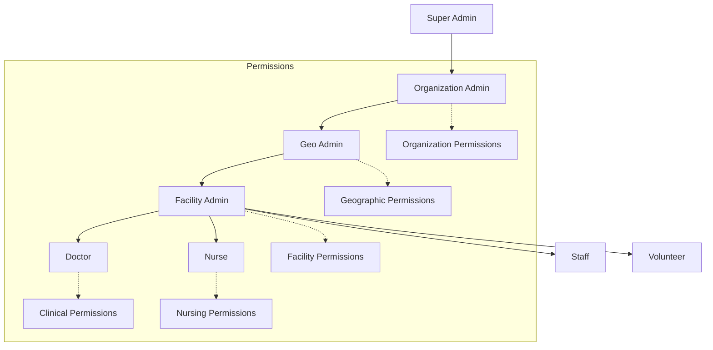

---

## User Flows

### Authentication Flow

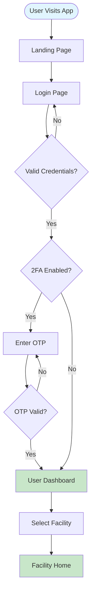

**Plugin Extension Point:** `[PLUGIN: PatientExternalRegistration]` - External authentication providers

---

### Patient Management Flow

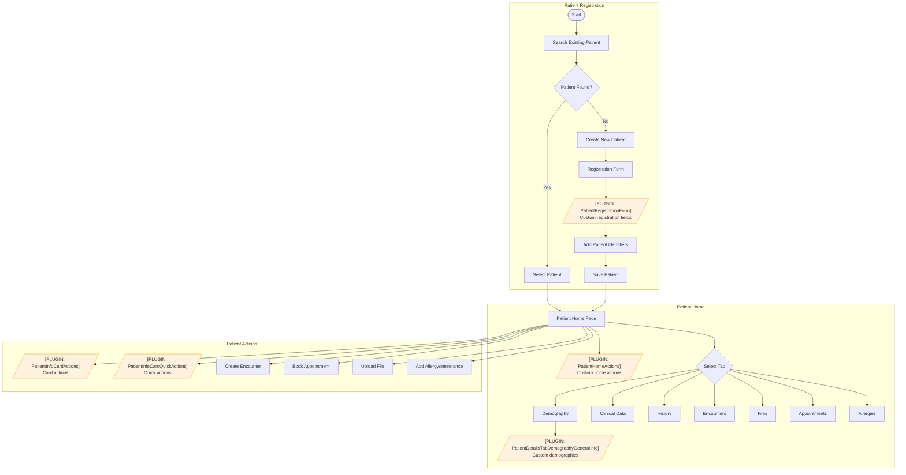

---

### Clinical Encounter Flow

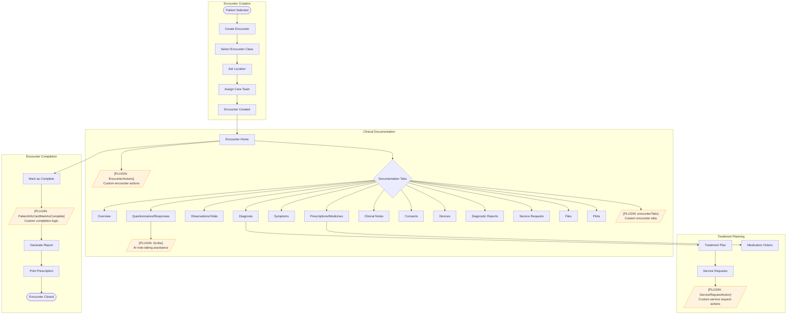

---

### Medication Management Flow

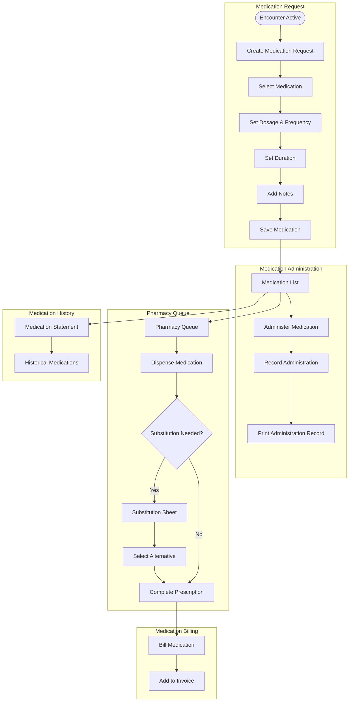

---

### Care Team Management Flow

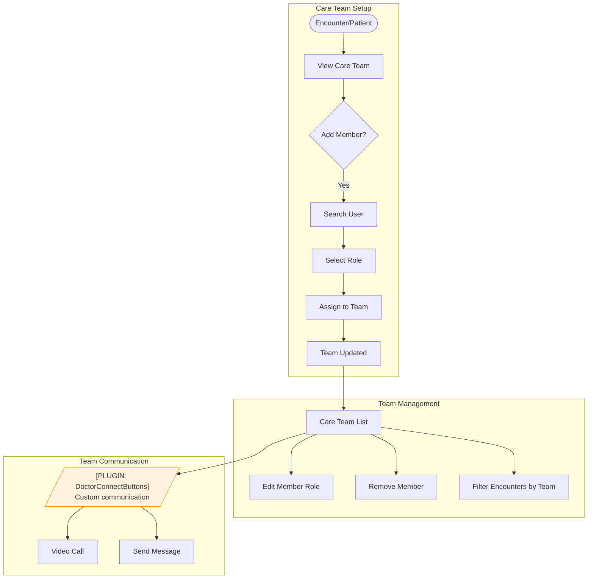

---

### Facility Management Flow

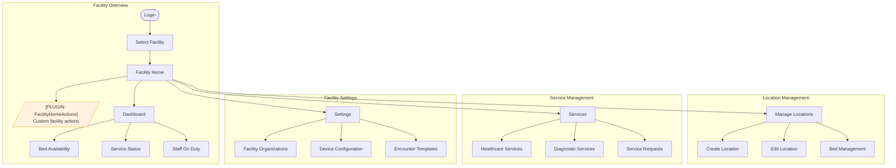

---

### Inventory & Supply Chain Flow

```mermaid
flowchart TD
    subgraph InternalTransfer["Internal Transfer"]
        Start([Facility]) --> Inventory[Inventory Management]
        Inventory --> InternalXfer[Internal Transfer]
        InternalXfer --> SelectSource[Select Source Location]
        SelectSource --> SelectDest[Select Destination]
        SelectDest --> SelectItems[Select Items]
        SelectItems --> SelectLots[Select Stock Lots]
        SelectLots --> ConfirmXfer[Confirm Transfer]
    end

    subgraph ExternalSupply["External Supply Chain"]
        Inventory --> ExternalSupply[External Supply]
        ExternalSupply --> PurchaseOrder[Purchase Order]
        ExternalSupply --> DeliveryOrder[Delivery Order]
        DeliveryOrder --> ToReceive[Items To Receive]
        PurchaseOrder --> ToDispatch[Items To Dispatch]
    end

    subgraph StockManagement["Stock Management"]
        Inventory --> StockLots[Stock Lot Management]
        StockLots --> ViewLots[View Stock Lots]
        StockLots --> ExpiryTracking[Expiry Tracking]
        StockLots --> LotSelection[Lot Selection for Dispense]
    end

    subgraph ProductKnowledge["Product Knowledge"]
        Inventory --> Products[Product Catalog]
        Products --> ProductDetails[Product Details]
        Products --> SupplierInfo[Supplier Information]
    end
```

---

### Device Management Flow

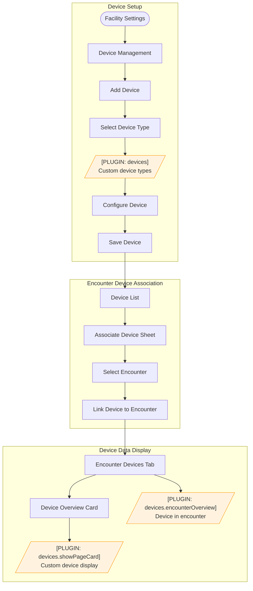

---

### Scheduling & Appointments Flow

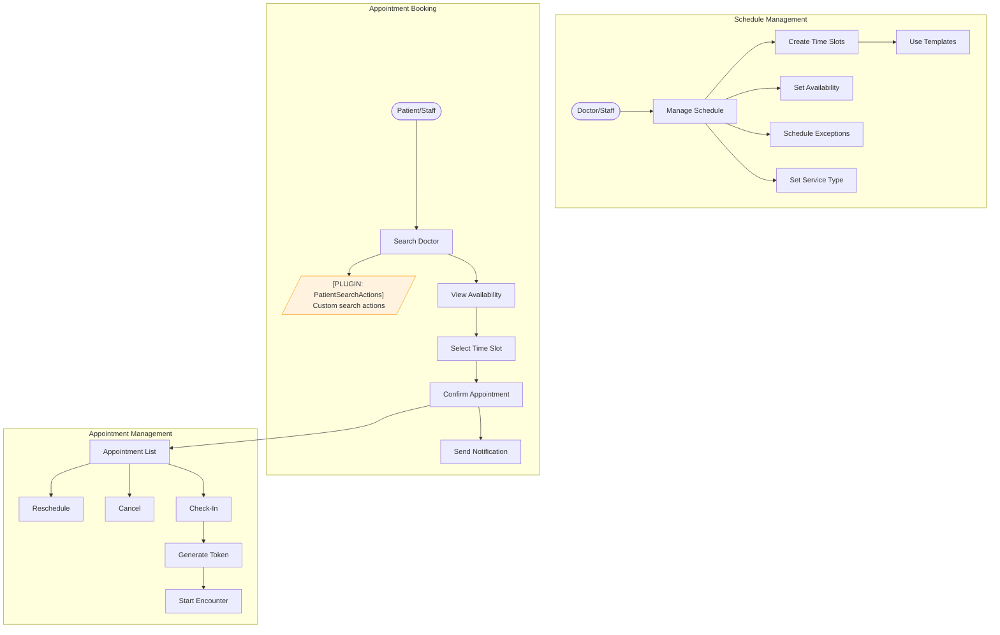

---

### Public Appointment Booking Flow

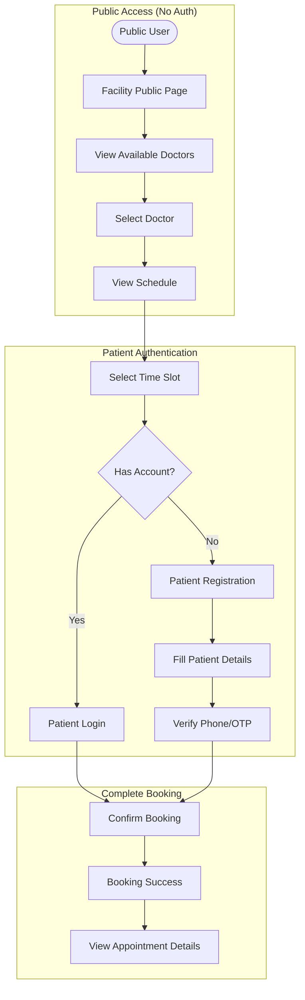

---

### Appointment Queuing Flow

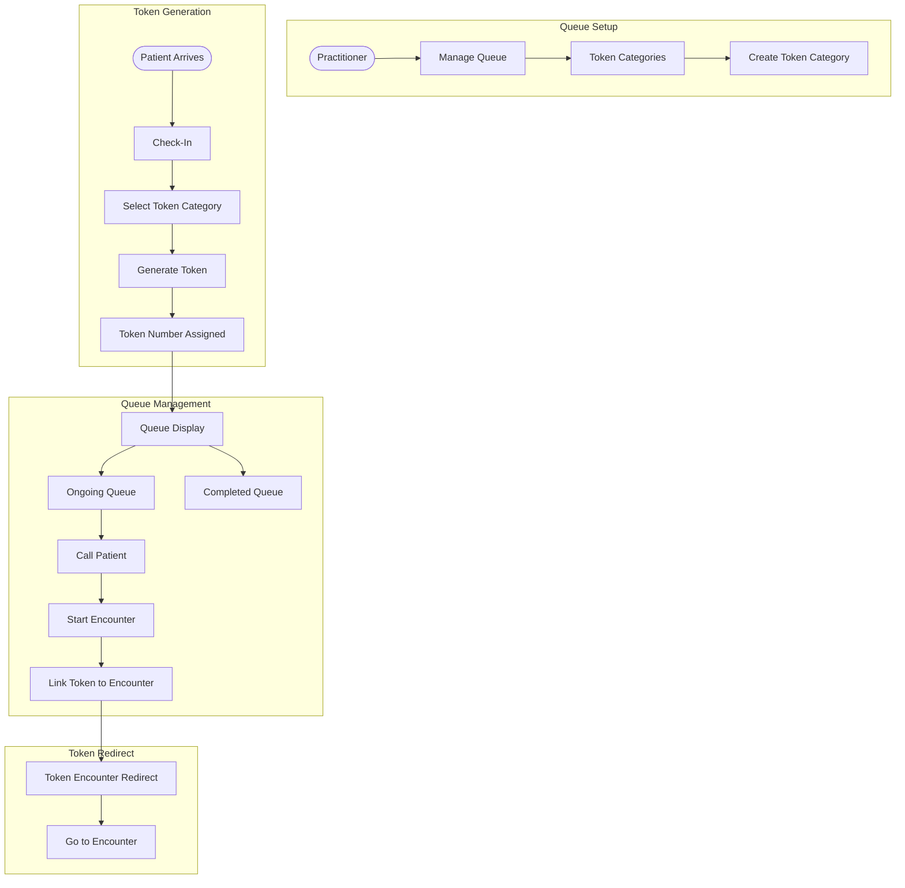

---

### Billing & Accounts Flow

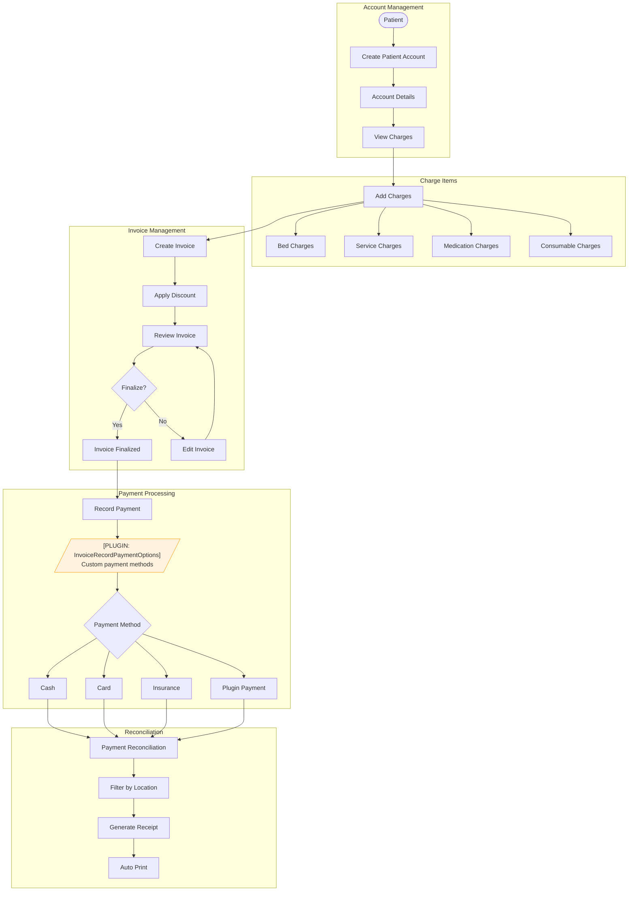

---

### Consent Management Flow

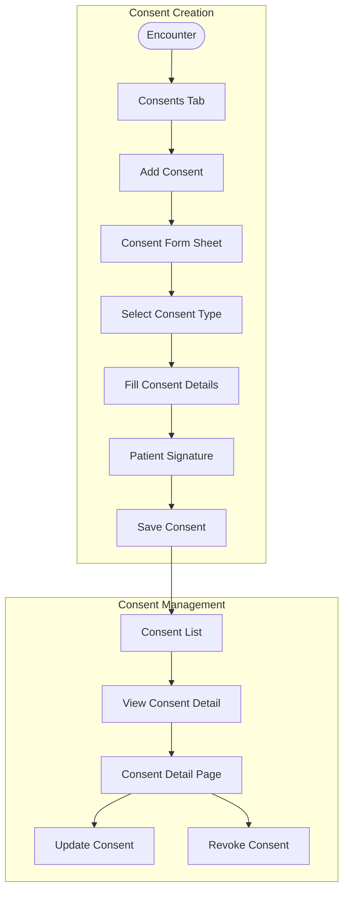

---

### File Management Flow

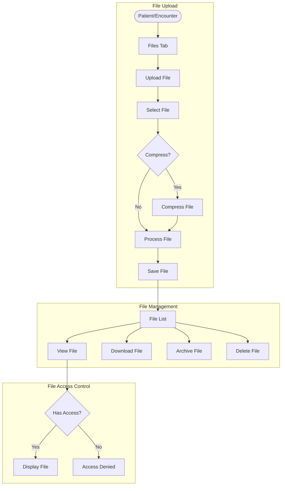

---

### Questionnaire & Templates Flow

```mermaid
flowchart TD
    subgraph QuestionnaireManagement["Questionnaire Management"]
        Start([Admin]) --> QuestList[Questionnaire List]
        QuestList --> CreateQuest[Create Questionnaire]
        CreateQuest --> QuestEditor[Questionnaire Editor]
        QuestEditor --> AddQuestions[Add Questions]
        AddQuestions --> SetConditions[Set Conditions]
        SetConditions --> EncClassEval[Encounter Class Evaluator]
        EncClassEval --> SaveQuest[Save Questionnaire]
    end

    subgraph ResponseTemplates["Response Templates"]
        SaveQuest --> ResponseTemplates[Response Templates]
        ResponseTemplates --> ManageTemplates[Manage Templates Sheet]
        ManageTemplates --> FacOrgSelector[Facility Organization Selector]
        FacOrgSelector --> CreateTemplate[Create Template]
    end

    subgraph EncounterTemplates["Encounter Templates"]
        Start2([Facility]) --> TemplateBuilder[Template Builder]
        TemplateBuilder --> SelectQuests[Select Questionnaires]
        SelectQuests --> ArrangeOrder[Arrange Order]
        ArrangeOrder --> SaveTemplate[Save Template]
        SaveTemplate --> ApplyToEnc[Apply to Encounters]
    end

    subgraph ValueSets["ValueSet Management"]
        QuestEditor --> ValueSets[ValueSets]
        ValueSets --> CreateValueSet[Create ValueSet]
        CreateValueSet --> AddOptions[Add Options]
        AddOptions --> UseInQuest[Use in Questionnaire]
    end
```

---

### User Preferences Flow

```mermaid
flowchart TD
    subgraph Preferences["User Preferences"]
        Start([User]) --> Settings[User Settings]
        Settings --> Preferences[Preferences]
        Preferences --> PinnedLinks[Pinned Links]
    end

    subgraph PinPages["Pin Pages"]
        AnyPage([Any Page]) --> PinDialog[Pin Page Dialog]
        PinDialog --> SetLabel[Set Label]
        SetLabel --> ConfirmPin[Confirm Pin]
        ConfirmPin --> AddToSidebar[Add to Sidebar]
    end

    subgraph ManagePins["Manage Pins"]
        PinnedLinks --> ViewPins[View Pinned Pages]
        ViewPins --> ReorderPins[Reorder Pins]
        ViewPins --> UnpinPage[Unpin Page]
        ViewPins --> EditLabel[Edit Label]
    end
```

---

## Plugin Extension Points

The system uses **Module Federation** for dynamic plugin loading. Plugins can extend the application at these points:

### Component Extension Points

| Extension Point | Location | Purpose |
|----------------|----------|---------|
| `PatientRegistrationForm` | Patient Registration | Add custom registration fields |
| `PatientHomeActions` | Patient Home Page | Add custom action buttons |
| `PatientInfoCardActions` | Patient Info Card | Add card-level actions |
| `PatientInfoCardQuickActions` | Patient Info Card | Add quick action buttons |
| `PatientInfoCardMarkAsComplete` | Patient Card | Custom completion logic |
| `PatientDetailsTabDemographyGeneralInfo` | Patient Demographics | Custom demographic fields |
| `PatientSearchActions` | Patient Search | Custom search features |
| `EncounterActions` | Encounter Page | Custom encounter actions |
| `FacilityHomeActions` | Facility Home | Custom facility actions |
| `DoctorConnectButtons` | Doctor Connect | Custom communication buttons |
| `Scribe` | Questionnaire Form | AI-assisted note taking |
| `ServiceRequestAction` | Service Requests | Custom service actions |
| `InvoiceRecordPaymentOptions` | Billing/Payment | Custom payment methods |

### Device Plugin Manifest

Plugins can provide custom device types with:

```typescript
interface PluginDeviceManifest {
  type: string;              // Device care_type
  icon: IconComponent;       // Custom device icon
  configureForm: Component;  // Device configuration UI
  showPageCard: Component;   // Device display card
  encounterOverview: Component; // Device data in encounter
}
```

### Encounter Tab Extensions

Plugins can add custom tabs to encounters:

| Built-in Tabs | Description |
|--------------|-------------|
| Overview | Encounter summary |
| Responses | Questionnaire responses |
| Observations | Vitals and observations |
| Medicines | Medications/Prescriptions |
| Notes | Clinical notes |
| Consents | Patient consents |
| Devices | Associated devices |
| Diagnostic Reports | Lab/diagnostic reports |
| Service Requests | Service requests |
| Files | Uploaded files |
| Plots | Data visualization |

Custom tabs via `encounterTabs` plugin manifest.

### Navigation Extension Points

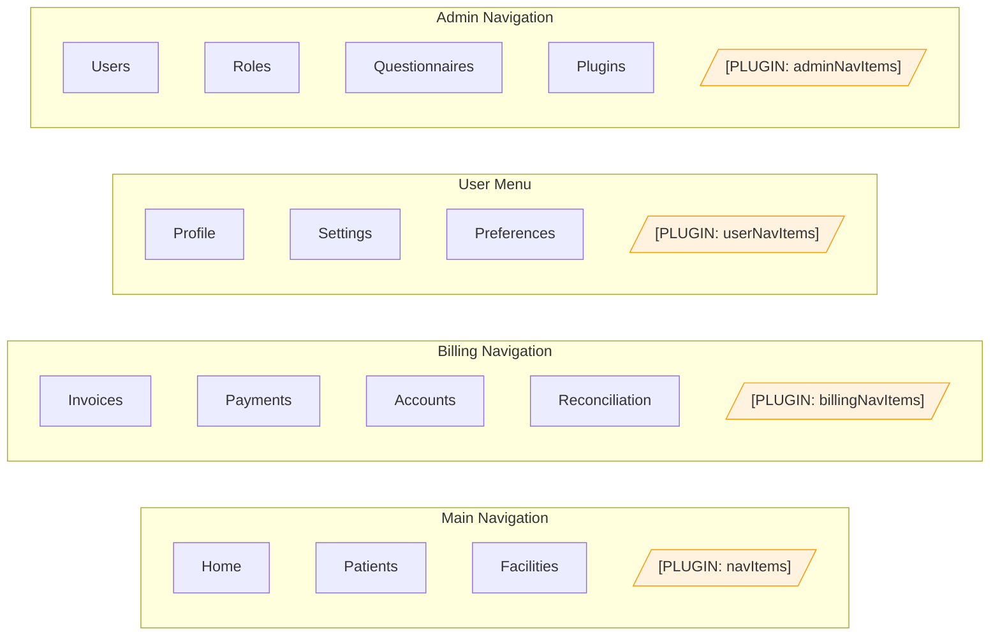

### Route Extension Points

Plugins can add custom routes:

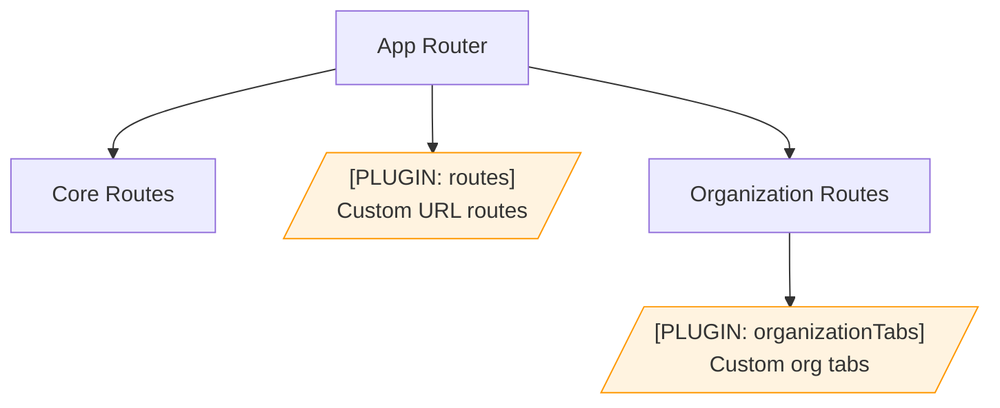

### Plugin Architecture

```mermaid
flowchart TD
    subgraph Backend["Backend API"]
        PlugAPI["/api/v1/plug_config/"]
    end

    subgraph PluginEngine["Plugin Engine"]
        FetchConfig[Fetch Plugin Configs]
        ModFed[Module Federation]
        LoadManifest[Load Plugin Manifests]
        RenderPlugin[Render Plugin Components]
    end

    subgraph PluginManifest["Plugin Manifest"]
        Components[Component Exports]
        Routes[Route Definitions]
        NavItems[Navigation Items]
        Devices[Device Manifests]
        EncTabs[Encounter Tabs]
        OrgTabs[Organization Tabs]
        Extends[Extension Types]
    end

    subgraph ErrorHandling["Error Handling"]
        ErrorBoundary[Plugin Error Boundary]
        Suspense[Suspense Fallback]
    end

    PlugAPI --> FetchConfig
    FetchConfig --> ModFed
    ModFed --> LoadManifest
    LoadManifest --> PluginManifest
    PluginManifest --> RenderPlugin
    RenderPlugin --> ErrorBoundary
    RenderPlugin --> Suspense
```

### Plugin Extension Types

```typescript
type SupportedPluginExtensions =
  | "DoctorConnectButtons"      // Extend doctor communication
  | "PatientExternalRegistration"; // External patient registration
```

---

## Permission System

### Permission Categories

```mermaid
flowchart TD
    subgraph PatientPerms["Patient Permissions"]
        P1[can_create_patient]
        P2[can_write_patient]
        P3[can_list_patients]
        P4[can_view_clinical_data]
    end

    subgraph EncounterPerms["Encounter Permissions"]
        E1[can_create_encounter]
        E2[can_write_encounter]
        E3[can_read_encounter]
        E4[can_read_encounter_clinical_data]
    end

    subgraph FacilityPerms["Facility Permissions"]
        F1[can_create_facility]
        F2[can_read_facility]
        F3[can_update_facility]
        F4[can_write_facility_locations]
    end

    subgraph OrgPerms["Organization Permissions"]
        O1[can_view_organization]
        O2[can_manage_organization]
        O3[can_manage_organization_users]
        O4[is_geo_admin]
    end

    subgraph SchedulePerms["Schedule Permissions"]
        S1[can_list_booking]
        S2[can_write_booking]
        S3[can_reschedule_booking]
        S4[can_write_schedule]
    end

    subgraph AdminPerms["Admin Permissions"]
        A1[can_create_user]
        A2[can_list_user]
        A3[can_write_questionnaire]
        A4[can_manage_questionnaire]
    end
```

### Permission Flow

```mermaid
flowchart TD
    User([User]) --> Auth[Authenticate]
    Auth --> LoadPerms[Load Permissions]
    LoadPerms --> Sources{Permission Sources}
    Sources --> Direct[Direct User Permissions]
    Sources --> Facility[Facility Permissions]
    Sources --> Org[Organization Permissions]
    Sources --> Super[Super Admin Flag]

    Direct --> Merge[Merge Permissions]
    Facility --> Merge
    Org --> Merge
    Super --> Merge

    Merge --> Context[Permission Context]
    Context --> Check{Check Permission}
    Check -->|Has Permission| Allow[Allow Action]
    Check -->|No Permission| Deny[Deny Action]
```

---

## State Management

### Context Providers

| Context | Purpose | File |
|---------|---------|------|
| `PermissionContext` | Permission checking | `src/context/PermissionContext.tsx` |
| `ShortcutContext` | Keyboard shortcuts | `src/context/ShortcutContext.tsx` |
| `CareAppsContext` | Plugin management | `src/hooks/useCareApps.tsx` |
| `EncounterProvider` | Encounter state | `src/pages/Encounters/utils/EncounterProvider.tsx` |
| `AuthUserProvider` | Authentication state | `src/Providers/AuthUserProvider.tsx` |
| `PatientUserProvider` | Patient portal context | `src/Providers/PatientUserProvider.tsx` |
| `HistoryAPIProvider` | Navigation history | `src/Providers/HistoryAPIProvider.tsx` |

### Jotai Atoms (Global State)

| Atom | Purpose | File |
|------|---------|------|
| `developerMode` | Developer mode toggle | `src/atoms/developerMode.ts` |
| `encounterFilterAtom` | Encounter filter state | `src/atoms/encounterFilterAtom.ts` |
| `navExpansionAtom` | Sidebar expansion state | `src/atoms/navExpansionAtom.ts` |
| `paymentReconcilationLocationAtom` | Payment location filter | `src/atoms/paymentReconcilationLocationAtom.ts` |
| `pharmacyAtom` | Pharmacy queue state | `src/atoms/pharmacy.ts` |
| `scheduleServiceTypeAtom` | Schedule service type cache | `src/atoms/scheduleServiceTypeAtom.ts` |
| `userAtom` | Current user state | `src/atoms/user-atom.ts` |

---

## Recent Features

### Latest Updates (2025)

| Feature | Description | Related Flow |
|---------|-------------|--------------|
| Care Team Support | Care team user types and filtering | Care Team Management |
| Facility Organization Selector | Organization-specific templates | Questionnaire Templates |
| User Preferences | Pinned links/bookmarks | User Preferences |
| Schedule Service Type Caching | Performance optimization | Scheduling |
| Encounter Class in Medication | Encounter-aware medications | Medication Management |
| Token Encounter Linking | Queue-encounter integration | Appointment Queuing |
| Condition Editor Enhancements | Encounter class in conditions | Questionnaire Templates |
| External Links Integration | Links in definitions | Diagnostic Reports |
| Auto Print on Payment | Automatic receipt printing | Billing |
| Medication Notes in Billing | Display med notes in bills | Medication/Billing |

---

## Key Files Reference

| Category | File Path |
|----------|-----------|
| **Plugin System** | |
| Plugin Engine | `src/PluginEngine.tsx` |
| Plugin Types | `src/pluginTypes.ts` |
| Plugin Hooks | `src/hooks/useCareApps.tsx` |
| Plugin API | `src/types/plugConfig/plugConfigApi.ts` |
| Plugin Devices Hook | `src/pages/Facility/settings/devices/hooks/usePluginDevices.ts` |
| **Permission System** | |
| Permission Context | `src/context/PermissionContext.tsx` |
| Permission Constants | `src/common/Permissions.tsx` |
| Permission Types | `src/types/emr/permission/permission.ts` |
| Role Types | `src/types/emr/role/role.ts` |
| **Routing** | |
| App Router | `src/Routers/AppRouter.tsx` |
| Patient Router | `src/Routers/PatientRouter.tsx` |
| Public Router | `src/Routers/PublicRouter.tsx` |
| Route Definitions | `src/Routers/routes/` |
| **State Management** | |
| Jotai Atoms | `src/atoms/` |
| Context Providers | `src/context/`, `src/Providers/` |
| **Key Components** | |
| Encounter Provider | `src/pages/Encounters/utils/EncounterProvider.tsx` |
| Care Team | `src/components/CareTeam/` |
| Medication | `src/components/Medication/` |
| Inventory | `src/pages/Facility/services/inventory/` |
| Questionnaire Editor | `src/components/Questionnaire/` |
| Template Builder | `src/pages/Encounters/TemplateBuilder/` |

---

## Legend

| Symbol | Meaning |
|--------|---------|
| `[PLUGIN: name]` | Plugin extension point - behavior can be customized via plugins |
| Orange boxes | Plugin-customizable components |
| Green boxes | Successful completion states |
| Blue boxes | Starting points |
| Dashed arrows | Permission relationships |
