# Care Frontend - Flow Diagrams

This document describes the main user flows, actors, and plugin extension points in the Care healthcare management system.

---

## Table of Contents

1. [System Overview](#system-overview)
2. [Actors & Roles](#actors--roles)
3. [User Flows](#user-flows)
   - [Authentication Flow](#authentication-flow)
   - [Patient Management Flow](#patient-management-flow)
   - [Clinical Encounter Flow](#clinical-encounter-flow)
   - [Facility Management Flow](#facility-management-flow)
   - [Scheduling & Appointments Flow](#scheduling--appointments-flow)
   - [Billing Flow](#billing-flow)
4. [Plugin Extension Points](#plugin-extension-points)
5. [Permission System](#permission-system)

---

## System Overview

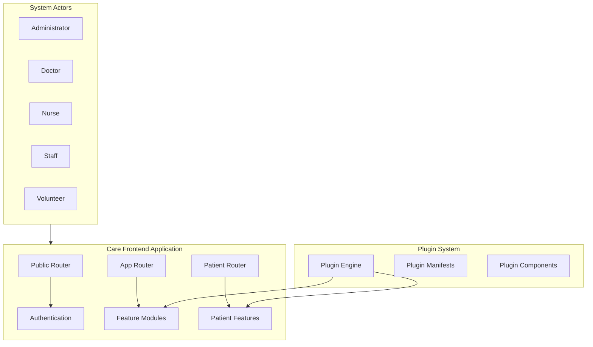

---

## Actors & Roles

### User Types

| Actor | Description | Primary Responsibilities |
|-------|-------------|-------------------------|
| **Administrator** | System administrator | User management, facility configuration, plugin management |
| **Doctor** | Healthcare practitioner | Patient consultations, prescriptions, clinical documentation |
| **Nurse** | Nursing staff | Patient care, vitals monitoring, medication administration |
| **Staff** | General facility staff | Administrative tasks, patient registration, scheduling |
| **Volunteer** | Volunteer workers | Support activities, patient assistance |

### Role Hierarchy

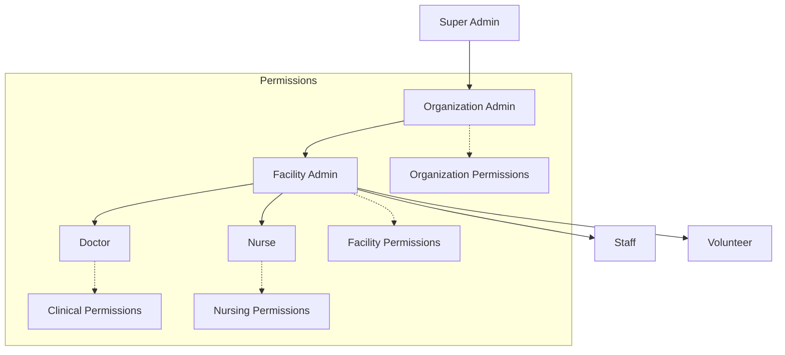

---

## User Flows

### Authentication Flow

**Plugin Extension Point:** `[PLUGIN: PatientExternalRegistration]` - External authentication providers

---

### Patient Management Flow

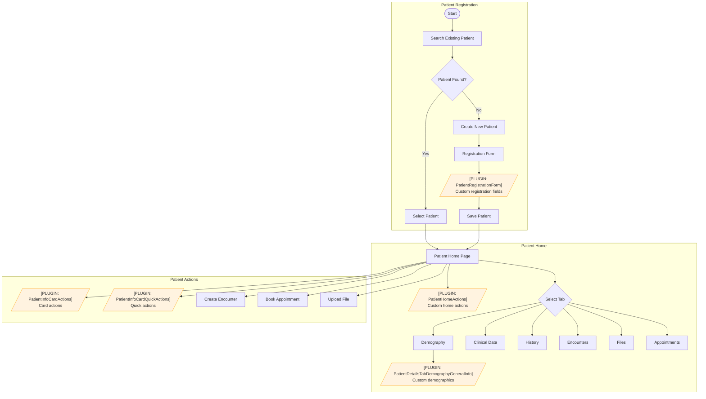

---

### Clinical Encounter Flow

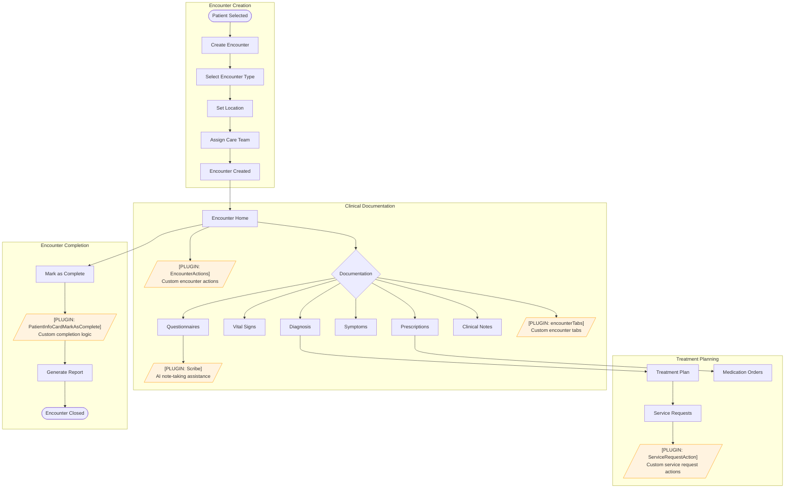

---

### Facility Management Flow

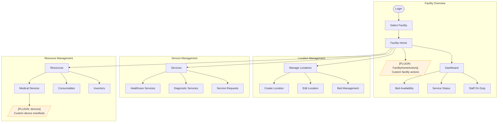

---

### Scheduling & Appointments Flow

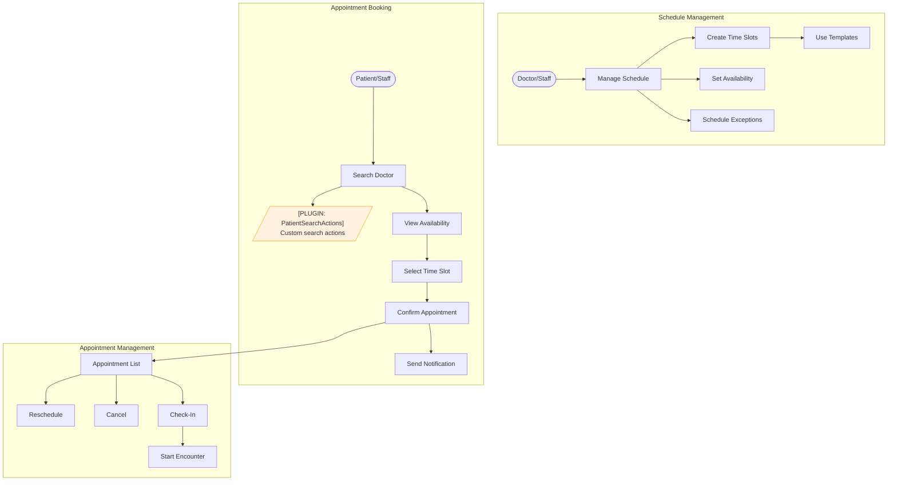

---

### Billing Flow

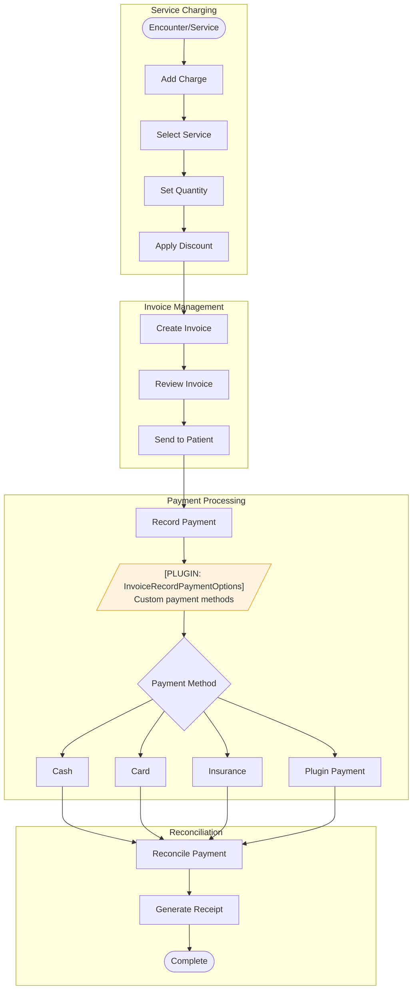

---

## Plugin Extension Points

The system uses **Module Federation** for dynamic plugin loading. Plugins can extend the application at these points:

### Component Extension Points

| Extension Point | Location | Purpose |
|----------------|----------|---------|
| `PatientRegistrationForm` | Patient Registration | Add custom registration fields |
| `PatientHomeActions` | Patient Home Page | Add custom action buttons |
| `PatientInfoCardActions` | Patient Info Card | Add card-level actions |
| `PatientInfoCardQuickActions` | Patient Info Card | Add quick action buttons |
| `PatientInfoCardMarkAsComplete` | Patient Card | Custom completion logic |
| `PatientDetailsTabDemographyGeneralInfo` | Patient Demographics | Custom demographic fields |
| `PatientSearchActions` | Patient Search | Custom search features |
| `EncounterActions` | Encounter Page | Custom encounter actions |
| `FacilityHomeActions` | Facility Home | Custom facility actions |
| `DoctorConnectButtons` | Doctor Connect | Custom communication buttons |
| `Scribe` | Questionnaire Form | AI-assisted note taking |
| `ServiceRequestAction` | Service Requests | Custom service actions |
| `InvoiceRecordPaymentOptions` | Billing/Payment | Custom payment methods |

### Navigation Extension Points

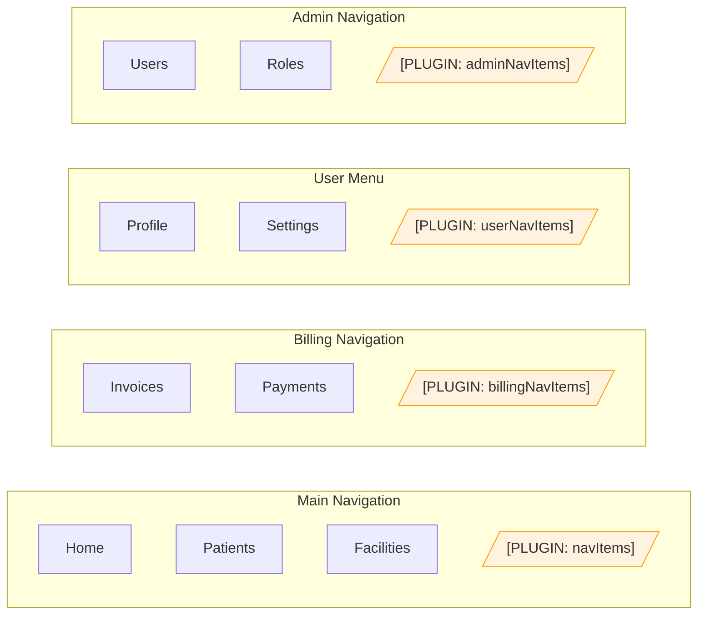

### Route Extension Points

Plugins can add custom routes:

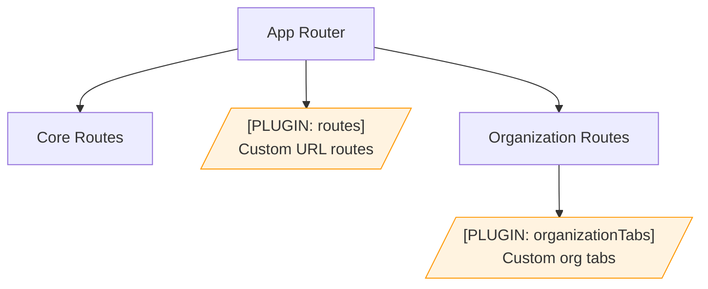

### Plugin Architecture

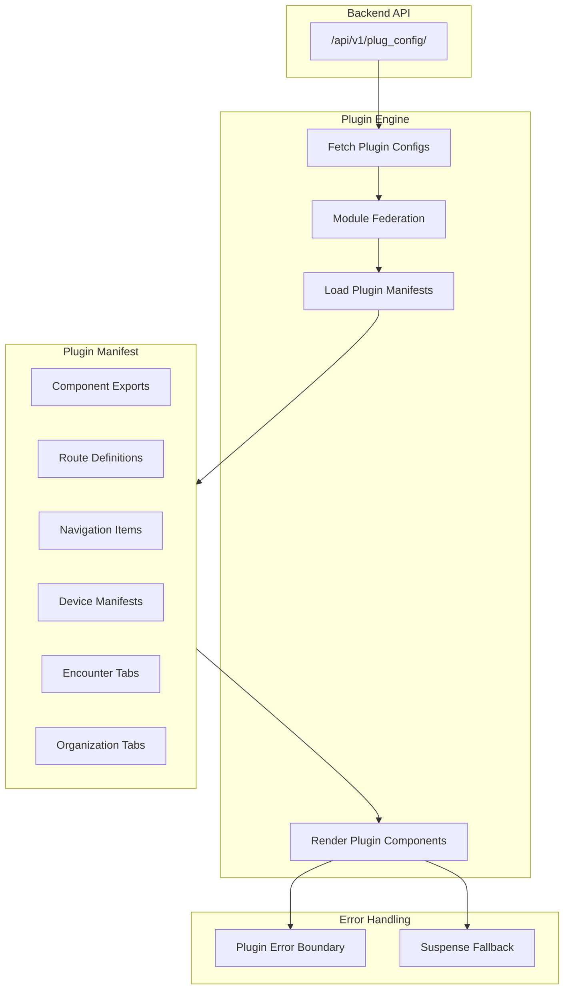

---

## Permission System

### Permission Categories

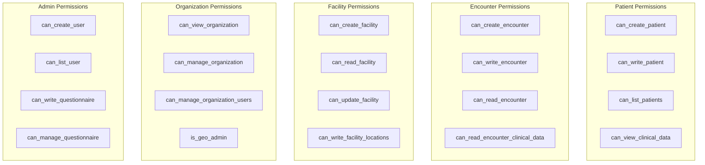

### Permission Flow

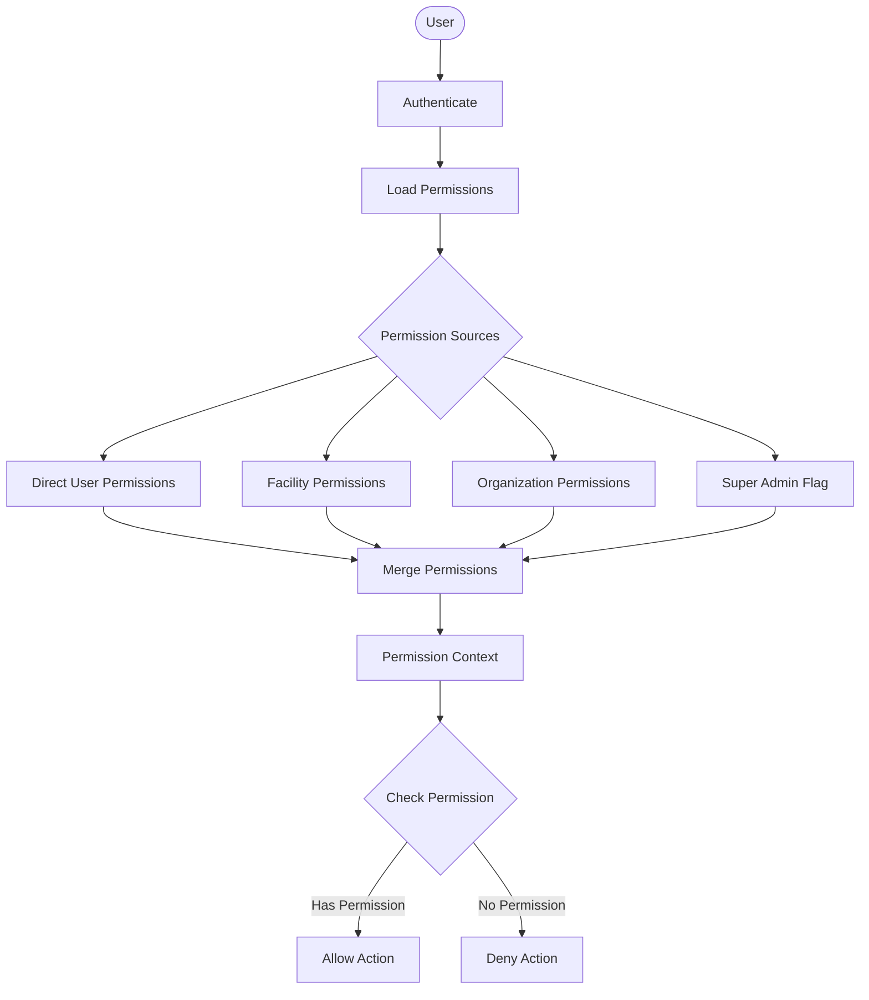

---

## Key Files Reference

| Category | File Path |
|----------|-----------|
| **Plugin System** | |
| Plugin Engine | `src/PluginEngine.tsx` |
| Plugin Types | `src/pluginTypes.ts` |
| Plugin Hooks | `src/hooks/useCareApps.tsx` |
| Plugin API | `src/types/plugConfig/plugConfigApi.ts` |
| **Permission System** | |
| Permission Context | `src/context/PermissionContext.tsx` |
| Permission Constants | `src/common/Permissions.tsx` |
| Permission Types | `src/types/emr/permission/permission.ts` |
| Role Types | `src/types/emr/role/role.ts` |
| **Routing** | |
| App Router | `src/Routers/AppRouter.tsx` |
| Patient Router | `src/Routers/PatientRouter.tsx` |
| Public Router | `src/Routers/PublicRouter.tsx` |
| Route Definitions | `src/Routers/routes/` |

---

## Legend

| Symbol | Meaning |
|--------|---------|
| `[PLUGIN: name]` | Plugin extension point - behavior can be customized via plugins |
| Orange boxes | Plugin-customizable components |
| Green boxes | Successful completion states |
| Blue boxes | Starting points |
